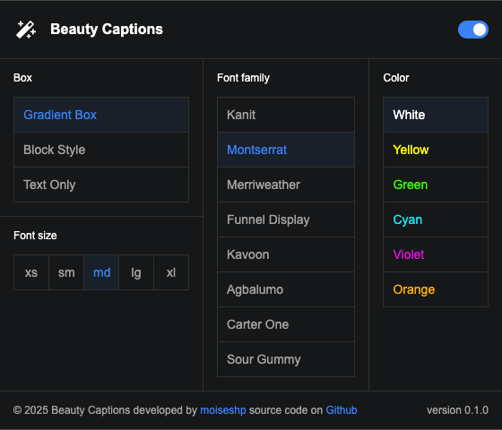
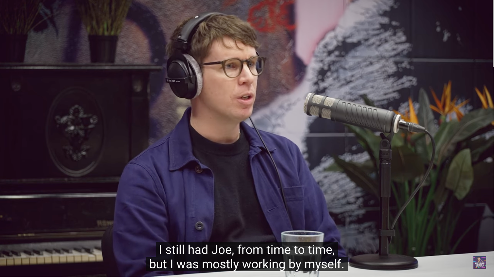
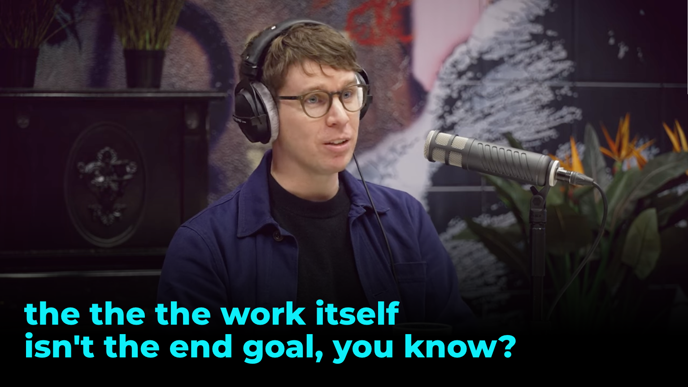
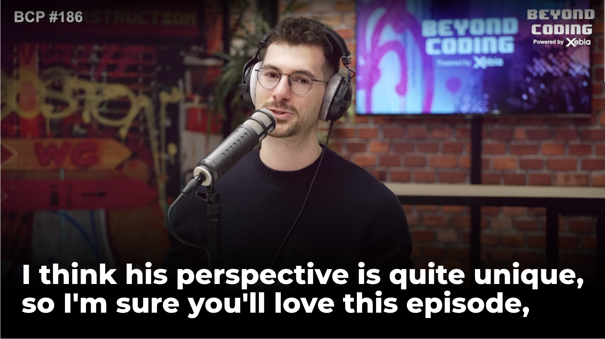

# BeautyCaptions - Enhance Your YouTube Subtitles

<div align="center">
  
</div>

Tired of plain and boring subtitles? **BeautyCaptions** lets you transform YouTube subtitles with modern, stylish, and eye-catching designs. Choose from a variety of beautiful presets or customize them to match your personal style.

## ✨ Features

- 🎨 Stylish and modern subtitle designs
- 🎭 Multiple preset themes for instant customization
- ⚡ Easy-to-use interface for a seamless experience
- 🔍 Enhance readability and aesthetics effortlessly

## Example

### Without Beauty Captions



### With Beauty Captions

  


## 🚀 Installation

1. Clone this repository:
   ```sh
   git clone https://github.com/your-username/beauty-captions.git
   cd beauty-captions
   ```
2. Open Chrome and navigate to `chrome://extensions/`.
3. Enable **Developer mode** (top right corner).
4. Click **Load unpacked** and select the `beauty-captions` folder.
5. Enjoy customizing your YouTube subtitles! 🎬

## 🖼 Screenshots

_Add some screenshots of your extension in action here!_

## 📌 Usage

1. Open any YouTube video with subtitles.
2. Click the **BeautyCaptions** extension icon.
3. Select a preset or customize styles as you like.
4. Enjoy beautifully styled captions!

## 🛠 Development

Feel free to contribute! Fork this repository and submit a pull request with your improvements.

## 📜 License

This project is licensed under the [MIT License](LICENSE).

---

💖 **Enhance your subtitles. Enjoy a better YouTube experience with BeautyCaptions!**
